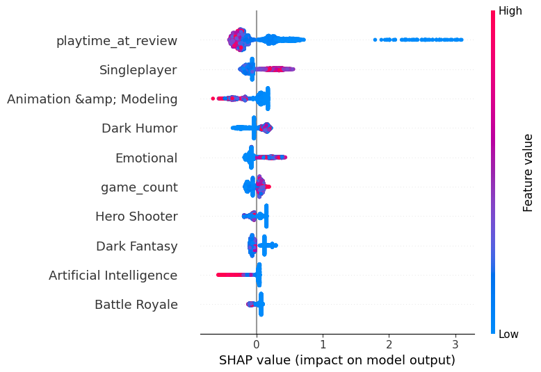
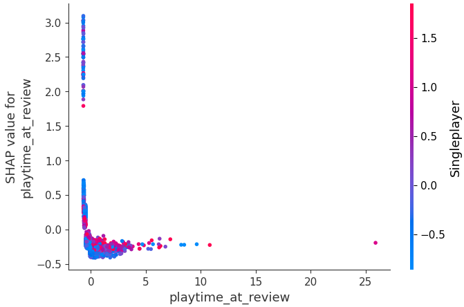
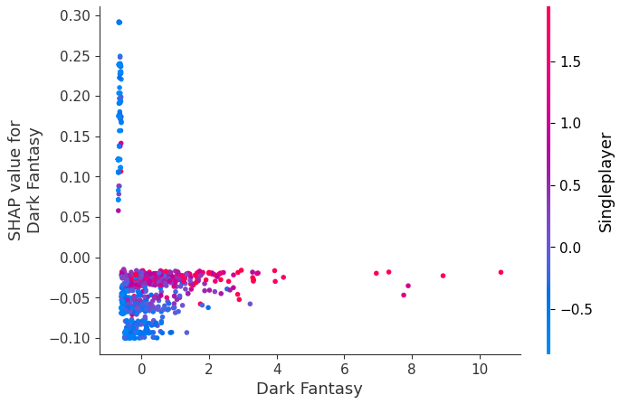
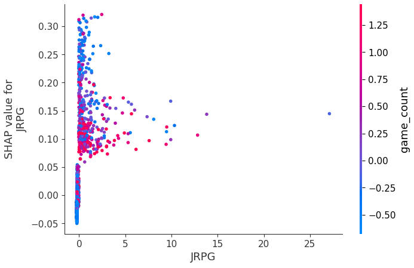
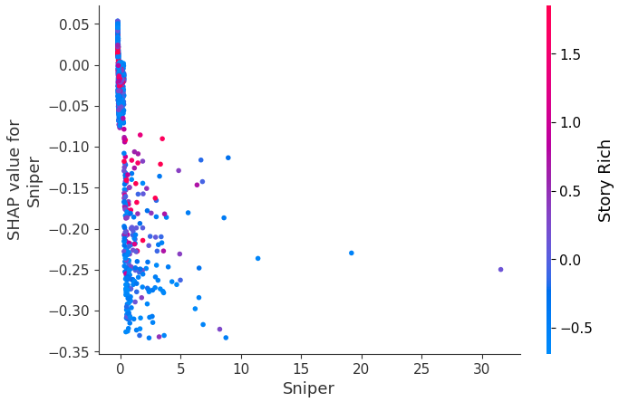

# Feature Importance of Machine Learning Models Applied to Elden Ring Reviews and User Gaming History

A machine learning project that uses Logistic Regression, Random Forest, and LightGBM to predict negative reviews of *Elden Ring* based on users' gaming history. The project employs SHAP (SHapley Additive exPlanations) to analyze feature importance and understand which gaming preferences influence user feedback.

## Overview

This project explores whether a user's gaming history can predict their likelihood of giving a negative review to *Elden Ring*. Despite the game's critical acclaim (Game Awards Best Game of 2022) and 92% positive reviews on Steam, understanding the gaming profiles that lead to negative reviews can help identify target audiences and inform marketing strategies.

The project employs:
- **Data extraction** from Steam's Web API
- **Feature engineering** by aggregating playtime by game tags
- **Dimensionality reduction** using correlation filtering
- **Machine learning models**: Logistic Regression, Random Forest, and LightGBM
- **Explainable AI** using SHAP for feature importance analysis

## Motivation

The video game industry has generated over 400 billion dollars in revenue, surpassing movies, books, and music. Unlike passive media, video games rely on user interaction, creating unique experiences for each player. *Elden Ring* is known for its difficulty and dark fantasy atmosphere, which may not appeal to all gaming demographics.

This project aims to:
1. Predict negative reviews based on gaming history using multiple ML models
2. Identify which gaming preferences correlate with negative feedback
3. Provide insights for targeting the right audience

## Dataset

The dataset consists of two main components:

1. **Reviews Dataset**: Contains user reviews of *Elden Ring* with:
   - Steam IDs
   - Playtime in *Elden Ring* (playtime_at_review)
   - Number of reviews written (num_reviews)
   - Number of games owned
   - Review sentiment (voted_up → target variable, where 1 = negative review)

2. **User Gaming History**: Contains total playtime across all games in users' Steam libraries, aggregated by Steam Store tags (e.g., Action, FPS, Strategy, Dark Fantasy, etc.)

**Key Statistics:**
- 4,462 samples
- 366 features (after tag aggregation)
- 5.5% positive cases (negative reviews)
- Maximum correlation with target: 0.105 (Heist tag)
- Highly imbalanced dataset with poor linear correlation

**Top Correlated Features:**
- Heist: 0.105
- Gun Customization: 0.096
- Economy: 0.080
- num_reviews: 0.078
- Epic: 0.067

## Installation

### Prerequisites

- Python 3.7+
- pip or conda

### Setup

1. Clone the repository:
```bash
git clone https://github.com/edu-santiago/NN_Elden_Ring.git
cd NN_Elden_Ring
```

2. Install required packages:
```bash
pip install pandas numpy scikit-learn imbalanced-learn lightgbm shap xgboost torch tqdm
```

Or using conda:
```bash
conda install pandas numpy scikit-learn imbalanced-learn lightgbm shap xgboost pytorch tqdm -c conda-forge
```

## Project Structure

```
NN_Elden_Ring/
├── data/
│   └── extract_files.py          # Script to download datasets from Google Drive
├── utils/
│   ├── nn.py                      # Neural Network class definition (if needed)
│   ├── nn_utils.py                # Neural network utilities
│   ├── ml_utils.py                # Machine learning utilities
│   ├── pre_processing.py          # Data preprocessing functions
│   └── utils.py                   # General utilities and data loading
├── EDA.ipynb                      # Exploratory Data Analysis
├── ml_final_model.ipynb           # Final model training and SHAP analysis
├── model.ipynb                    # Model training and hyperparameter tuning (alternative)
├── model_final_run.ipynb          # Alternative final model evaluation
├── ml_model_results.csv           # Hyperparameter tuning results
├── imgs/                          # Project images
│   ├── shap.png                   # SHAP summary plot
│   ├── playtime.png               # Playtime at review dependence plot
│   ├── dark_fantasy.png           # Dark Fantasy tag dependence plot
│   ├── jrpg.png                   # JRPG tag dependence plot
│   ├── sniper.png                 # Sniper tag dependence plot
│   ├── singleplayer.png           # Singleplayer interaction plot
│   └── tp.png                     # Third-person interaction plot
└── README.md                       # This file
```

## Usage

### Step 1: Extract Data

First, run the data extraction script to download the datasets:

```bash
cd data
python extract_files.py
cd ..
```

This will download three CSV files:
- `final_reviews.csv`: User reviews of Elden Ring
- `df_tags.csv`: User gaming history aggregated by tags
- `true_user_data.csv`: Additional user data

### Step 2: Exploratory Data Analysis

Open `EDA.ipynb` to:
- Load and explore the datasets
- Analyze feature correlations with the target variable using point-biserial correlation
- Understand data distribution and class imbalance (94.4% negative reviews, 5.5% positive cases)
- Identify top correlated features

### Step 3: Model Training

The project uses three machine learning models with hyperparameter tuning:

#### Models Used:
1. **Logistic Regression** (scikit-learn)
2. **Random Forest** (scikit-learn)
3. **LightGBM** (Gradient Boosting)

#### Hyperparameter Tuning:

**Logistic Regression:**
- C: 0.1, 1, 10, 100
- solver: liblinear, saga
- max_iter: 100, 200, 500

**Random Forest:**
- n_estimators: 100, 200, 500
- max_depth: 5, 10, 20, 50
- min_samples_split: 5, 10
- min_samples_leaf: 2, 4, 6

**LightGBM:**
- n_estimators: 200, 500, 750
- max_depth: 5, 10, 20
- learning_rate: 0.001, 0.01, 0.1
- num_leaves: 10, 20, 50

#### Class Imbalance Handling:

Three strategies were tested:
1. **SMOTE**: Synthetic Minority Oversampling Technique
2. **Random Undersampling**: Reduce majority class
3. **Class Weights**: Adjust model weights (balanced for Logistic Regression/Random Forest, scale_pos_weight=18 for LightGBM)

#### Training Process:

- **Data Split**: 60% train / 20% validation / 20% test
- **Cross-Validation**: 5-fold stratified
- **Evaluation Metric**: F1 Score
- **Scaling**: StandardScaler applied to training data

### Step 4: Final Evaluation and SHAP Analysis

Open `ml_final_model.ipynb` to:
- Load the best model configuration from hyperparameter tuning results
- Train the best model on the full dataset
- Evaluate on validation and test sets
- Generate SHAP plots for feature importance analysis

## Results

### Model Performance

The best performing model was **LightGBM** trained without sampling techniques but with adjusted class weights (scale_pos_weight=18). The best hyperparameters were:

- n_estimators: 200
- max_depth: 10
- learning_rate: 0.01
- num_leaves: 10

**Final Metrics:**

| Dataset | Accuracy | Precision | Recall | F1 Score |
|---------|----------|-----------|--------|----------|
| Validation | 0.9034 | 0.3396 | 0.3462 | 0.3429 |
| Test | 0.9082 | 0.2000 | 0.2609 | 0.2264 |

**Note**: While the model achieved high accuracy, precision and recall remain low due to the severe class imbalance. The model provides valuable insights into feature importance despite these limitations.

### Feature Importance Analysis

#### SHAP Summary Plot



The SHAP summary plot reveals the most impactful features. The variable demonstrating the most significant impact is the user's own **playtime_at_review**. As expected, higher hours played generally correlate with positive reviews, whereas reviews with minimal playtime tend to be negative.

#### Playtime at Review



The playtime at review dependence plot shows that reviews with nearly zero playtime exhibit notably positive SHAP values (indicating negative reviews). As playtime increases, reviews tend to improve. However, this trend is softened when users predominantly engage in single-player experiences.

#### Dark Fantasy Tag



The Dark Fantasy game tag, comprised of games with thematic resemblance to *Elden Ring*, shows that higher playtime invested in dark fantasy games correlates positively with user affinity for the game. However, this correlation diminishes when users also allocate significant playtime to single-player experiences, softening the influence of this feature.

#### JRPG Tag



Gamers who invest more hours in Japanese RPG games, characterized by their slower pace, extensive dialogue, and prolonged gameplay, exhibit an inverse correlation with positive reviews of *Elden Ring*.

#### Sniper Tag



Gamers with increased playtime in games tagged as Sniper, typically emphasizing stealth, patience, and high-stakes gameplay, demonstrate a direct correlation with positive reviews. This correlation holds true even when considering thematic differences from *Elden Ring*.

### Key Insights

1. **Playtime is the strongest predictor**: Users with minimal playtime are most likely to give negative reviews
2. **Genre preferences matter**: 
   - Dark Fantasy games correlate positively with enjoying Elden Ring
   - JRPGs (slower pace, dialogue-heavy) correlate negatively
   - Sniper games (patience, tactical) correlate positively
3. **Multiplayer vs Single-player**: The multiplayer aspect of Elden Ring (cooperation and PvP invasions) may deter some players who prefer purely single-player experiences
4. **Target audience**: Players who enjoy:
   - Multiplayer experiences
   - Strategic planning and risk-taking
   - Games requiring patience and tactical combat
   - Dark fantasy themes

## Methodology

### Data Preprocessing

1. **Tag Aggregation**: Game playtime aggregated by Steam Store tags (366 features)
2. **Correlation Filtering**: Remove features with absolute correlation > 0.9
3. **Scaling**: StandardScaler applied to training data
4. **Class Imbalance**: Three strategies tested (SMOTE, undersampling, class weights)

### Model Selection

Models were evaluated using 5-fold stratified cross-validation with F1 Score as the optimization metric. The best model (LightGBM with class weights) was selected based on validation set performance.

### Explainable AI

SHAP (SHapley Additive exPlanations) was used to:
- Quantify the impact of each feature on model predictions
- Identify positive and negative influences
- Reveal feature interactions through dependence plots
- Understand nonlinear relationships

## Utilities

### `utils/utils.py`
- `load_data()`: Load and merge datasets
- `remove_highly_correlated_features()`: Remove redundant features
- `corr_filter()`: Correlation-based feature filtering

### `utils/pre_processing.py`
- `init_df()`: Initialize train/test/validation splits with optional scaling and sampling

### `utils/ml_utils.py`
- `create_dataset()`: Create datasets with different sampling strategies
- Model training and evaluation utilities

### `utils/nn.py` and `utils/nn_utils.py`
- Neural network implementations (for alternative approaches)

## Notebooks

- **EDA.ipynb**: Exploratory data analysis, correlation analysis, data visualization
- **ml_final_model.ipynb**: Final model training, evaluation, and SHAP analysis
- **model.ipynb**: Alternative model training approaches
- **model_final_run.ipynb**: Additional model evaluation

## Future Work

1. **Alternative models**: Explore models designed to handle unbalanced datasets more effectively
2. **Additional features**: 
   - Gaming achievements
   - Computer architecture
   - Gameplay behaviors before purchase
   - Pre-review data
3. **Improved sampling**: Better handling of class imbalance
4. **Feature engineering**: More sophisticated tag interactions and feature combinations
5. **Deep learning**: Explore neural network architectures for this task

## Author

**Eduardo N. S. Ramos**  
Email: eduardonsantiago@aluno.puc-rio.br

## License

This project is for academic/research purposes.

## Acknowledgments

- Steam Web API for providing game data
- SHAP library for explainable AI
- scikit-learn, LightGBM, and XGBoost communities

---

**Note**: This project demonstrates that while machine learning models may not achieve perfect classification for this task due to the severe class imbalance and low feature correlations, they provide valuable insights into gaming preferences and can serve as a baseline for identifying suitable gaming profiles. The SHAP analysis reveals meaningful patterns in user behavior that can inform marketing strategies and game development decisions.


